# SQL 判题引擎 - 数据流与时序图

## 1. 整体数据流概览

```
┌──────────────────────────────────────────────────────────────────────────────┐
│                              教师操作流程                                      │
├──────────────────────────────────────────────────────────────────────────────┤
│                                                                              │
│   教师                        Gateway                  Problem Service        │
│     │                            │                          │               │
│     │───── POST /api/problem ───►│──────────────────────────►│               │
│     │                            │                          │               │
│     │  创建题目                   │                          │ 存储题目元数据     │
│     │  (含初始化SQL、              │                          │ 存储测试用例      │
│     │   测试用例、                 │                          │                │
│     │   标准答案)                  │                          │                │
│     │                            │                          │               │
│     │◄──────── 201 Created ──────│◄──────────────────────────│               │
│     │                            │                          │               │
└──────────────────────────────────────────────────────────────────────────────┘

┌──────────────────────────────────────────────────────────────────────────────┐
│                              学生答题流程                                      │
├──────────────────────────────────────────────────────────────────────────────┤
│                                                                              │
│   学生                        Gateway                 Submission Svc          │
│     │                            │                          │               │
│     │───── POST /api/submission ►│─────────────────────────►│               │
│     │                            │                          │               │
│     │  提交 SQL 答案              │                          │ 记录提交       │
│     │                            │                          │ 投递判题任务    │
│     │                            │                          │ 到 RabbitMQ    │
│     │                            │                          │               │
│     │◄──────── 202 Accepted ─────│◄──────────────────────────│               │
│     │  (返回 submission_id)       │                          │               │
│     │                            │                          │               │
└──────────────────────────────────────────────────────────────────────────────┘

                                    │
                                    ▼
┌──────────────────────────────────────────────────────────────────────────────┐
│                              判题异步流程                                     │
├──────────────────────────────────────────────────────────────────────────────┤
│                                                                              │
│   Judge Service              Container Manager          RabbitMQ              │
│         │                            │                      │               │
│         │◄─────── consume ───────────│                      │               │
│         │    (判题任务消息)             │                      │               │
│         │                            │                      │               │
│         │──── POST /container/acquire ►│                      │               │
│         │                            │                      │               │
│         │      申请容器                │ 从池中获取可用容器      │               │
│         │                            │ 返回连接信息           │               │
│         │◄─── 200 {container_id, ...} ─│                      │               │
│         │                            │                      │               │
│         │ 连接容器内 MySQL             │                      │               │
│         │ 执行题目初始化SQL            │                      │               │
│         │ 执行学生 SQL                 │                      │               │
│         │ 结果比对(DQL/DML/DDL/DCL)    │                      │               │
│         │                            │                      │               │
│         │──── POST /result ──────────►│ (通过内部调用)         │               │
│         │      回写判题结果             │                      │               │
│         │                            │                      │               │
│         │──── POST /container/release ►│                      │               │
│         │      释放容器(重置后放回池)    │                      │               │
│         │                            │                      │               │
└──────────────────────────────────────────────────────────────────────────────┘
```

---

## 2. 核心时序图

### 2.1 用户注册登录流程

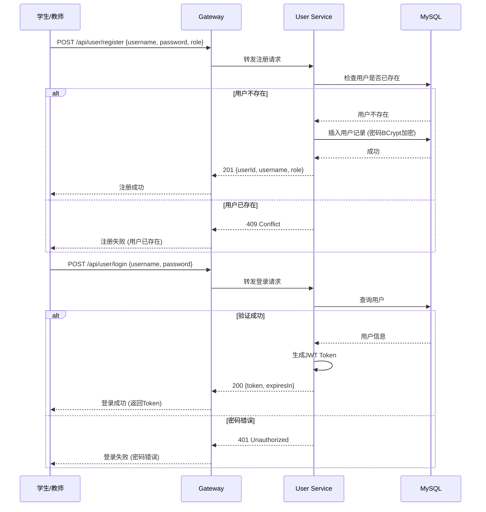

### 2.2 教师创建题目流程

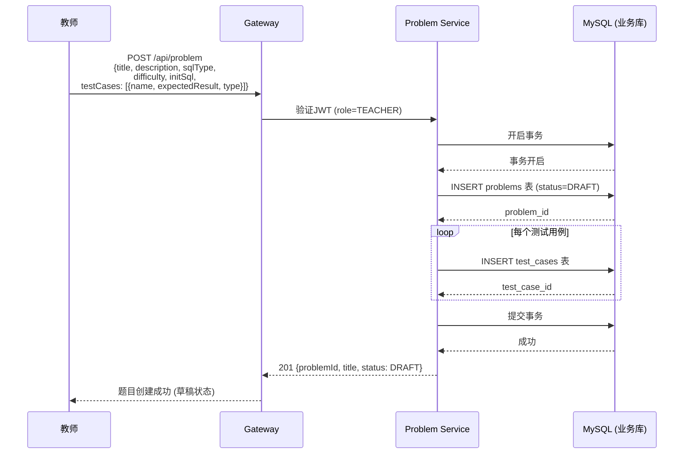

### 2.2.1 教师设置标准答案和期望结果

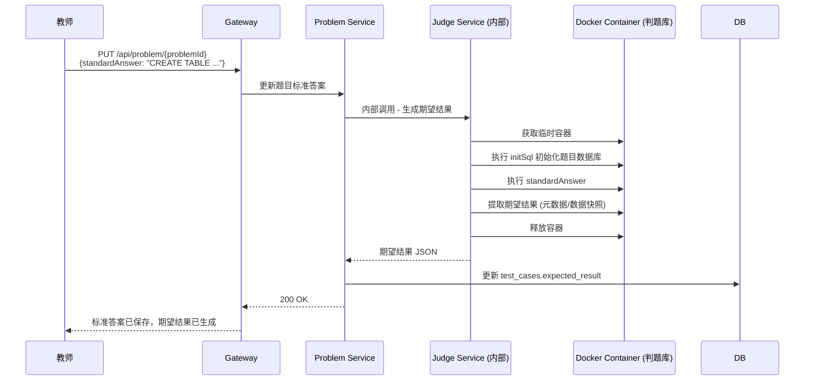

### 2.2.2 题目状态流转

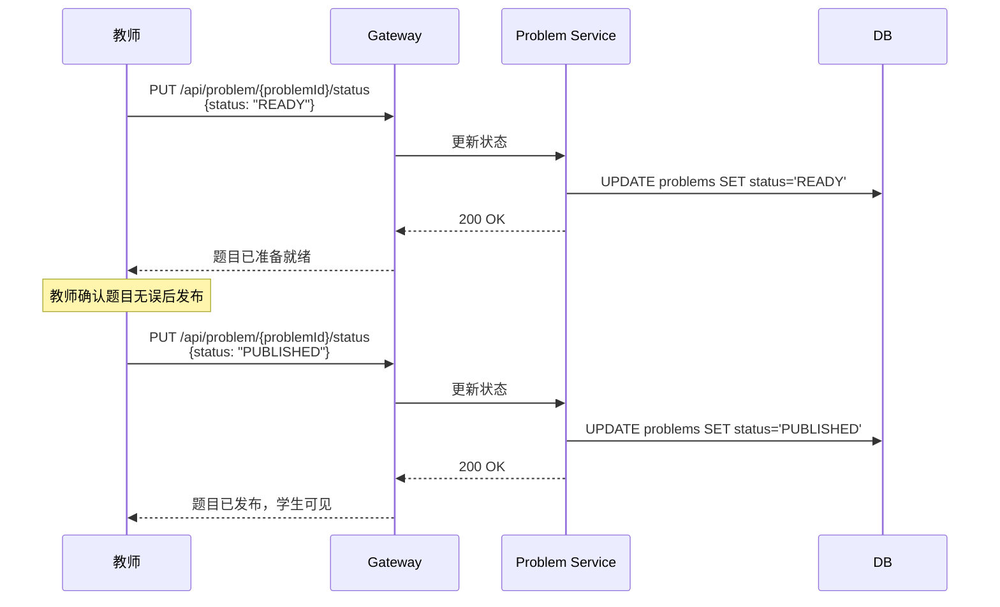

### 2.2.3 题目标签管理

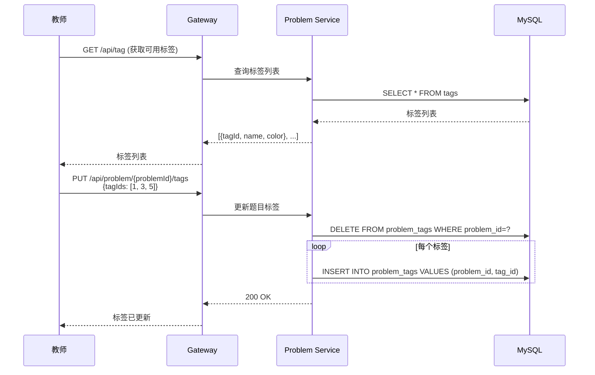

### 2.2.4 批量导入题目

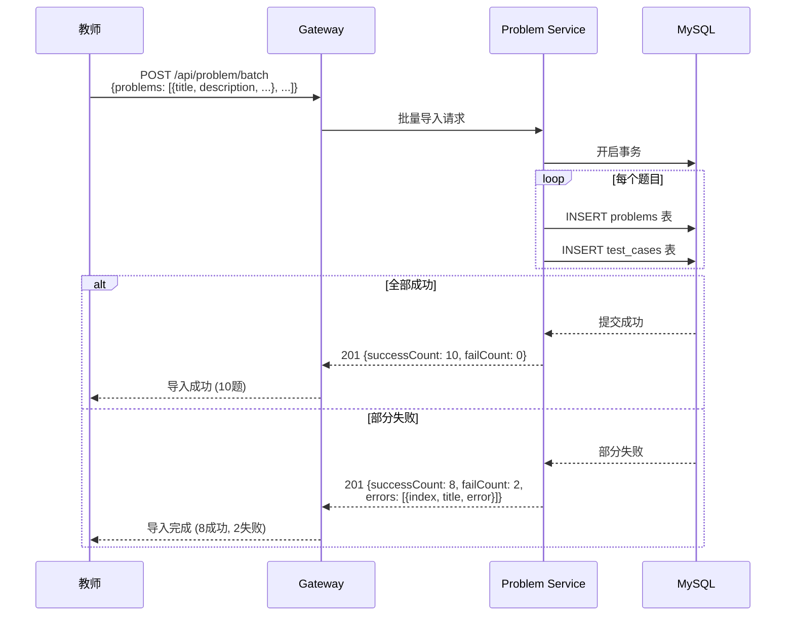

### 2.3 学生提交答案流程

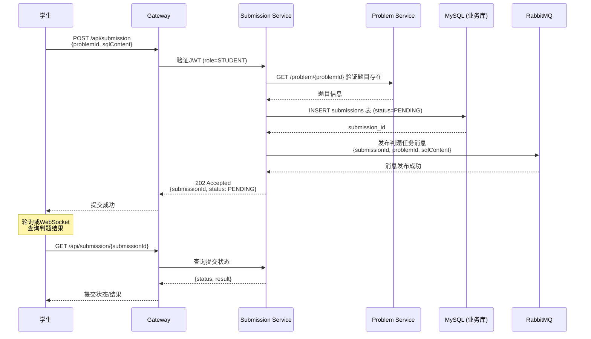

### 2.4 核心判题流程

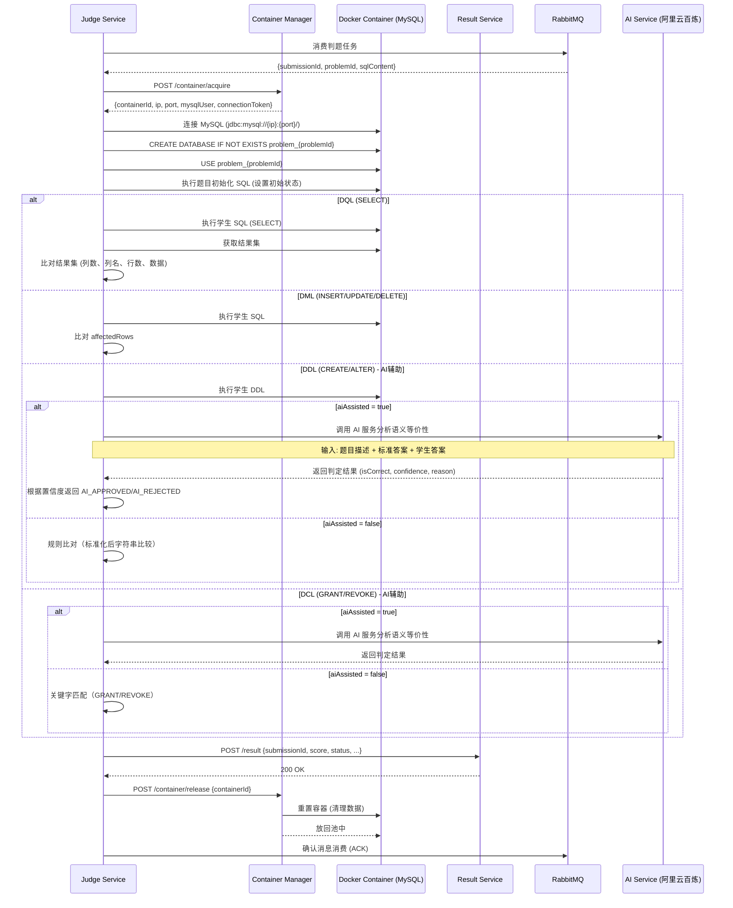

### 2.5 查询成绩流程

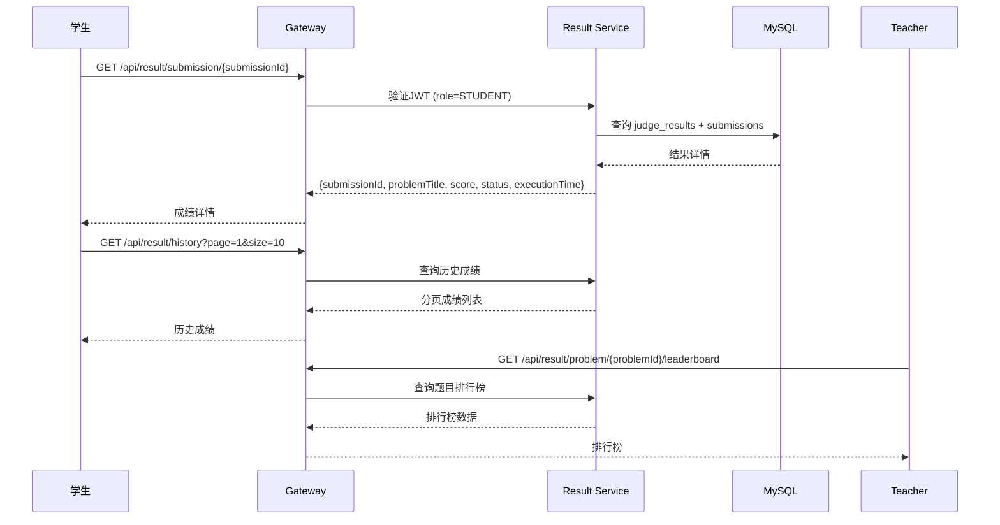

---

## 3. 数据模型关系

```
┌─────────────┐       ┌─────────────┐       ┌─────────────┐
│    users    │       │  problems   │       │ test_cases  │
├─────────────┤       ├─────────────┤       ├─────────────┤
│ id (PK)     │       │ id (PK)     │       │ id (PK)     │
│ username    │       │ title       │◄──────│ problem_id  │
│ password    │       │ description │       │ name        │
│ role        │       │ sql_type    │       │ init_sql    │
│ email       │       │ difficulty  │       │ expected_*  │
│ created_at  │       │ status      │       │ weight      │
└─────────────┘       │ teacher_id  │       └─────────────┘
                      │ created_at  │
                      └─────────────┘
                            │
                            │ N:M
                            ▼
┌─────────────┐       ┌─────────────┐
│problem_tags │       │    tags     │
├─────────────┤       ├─────────────┤
│ problem_id  │◄──────│ id (PK)     │
│ tag_id     │       │ name        │
└─────────────┘       │ color       │
                            │               └─────────────┘
                            ▼
┌─────────────┐       ┌─────────────┐       ┌─────────────┐
│submissions  │       │judge_results│       │  RabbitMQ   │
├─────────────┤       ├─────────────┤       ├─────────────┤
│ id (PK)     │──────►│ submission_id│      │ queue:      │
│ problem_id  │       │ test_case_id │      │ judge-tasks │
│ student_id  │       │ score        │      │ judge-results│
│ sql_content │       │ status       │      └─────────────┘
│ status      │       │ error_msg    │
│ submitted_at│       │ exec_time    │
└─────────────┘       └─────────────┘

┌─────────────────────────────────────────────────────────────┐
│                  Docker 容器内 MySQL                         │
├─────────────────────────────────────────────────────────────┤
│  Database: problem_{problem_id}                            │
│  ├── 初始化SQL创建的表和数据                                  │
│  └── 学生SQL执行后的数据变更                                  │
│                                                             │
│  注意: 每个容器有独立的MySQL实例，互不干扰                    │
└─────────────────────────────────────────────────────────────┘
```

---

## 4. 关键数据流转

### 4.1 判题任务消息格式

```json
{
  "messageId": "uuid",
  "submissionId": 12345,
  "problemId": 100,
  "sqlContent": "SELECT * FROM employees WHERE salary > 3000",
  "studentId": 1001,
  "timeLimit": 30,
  "maxMemory": 1024,
  "retryCount": 0,
  "timestamp": "2024-01-15T10:30:00Z"
}
```

| 字段 | 类型 | 说明 |
|------|------|------|
| messageId | uuid | 消息唯一标识 |
| submissionId | long | 提交ID |
| problemId | long | 题目ID |
| sqlContent | string | 学生提交的 SQL |
| studentId | long | 学生ID |
| timeLimit | int | 超时时间（秒），从题目难度获取 |
| maxMemory | int | 内存限制（MB） |
| retryCount | int | 重试次数，用于死信处理 |
| timestamp | datetime | 消息创建时间 |

### 4.2 判题结果回写

```json
{
  "submissionId": 12345,
  "overallScore": 85.0,
  "overallStatus": "PARTIAL_CORRECT",
  "testCaseResults": [
    {
      "testCaseId": 1,
      "score": 85.0,
      "status": "PARTIAL_CORRECT",
      "executionTimeMs": 150,
      "errorMessage": null
    }
  ],
  "metadata": {
    "containerId": "container_001",
    "executionTimeMs": 1500
  }
}
```

---

## 5. 错误处理流程

### 5.1 容器获取失败

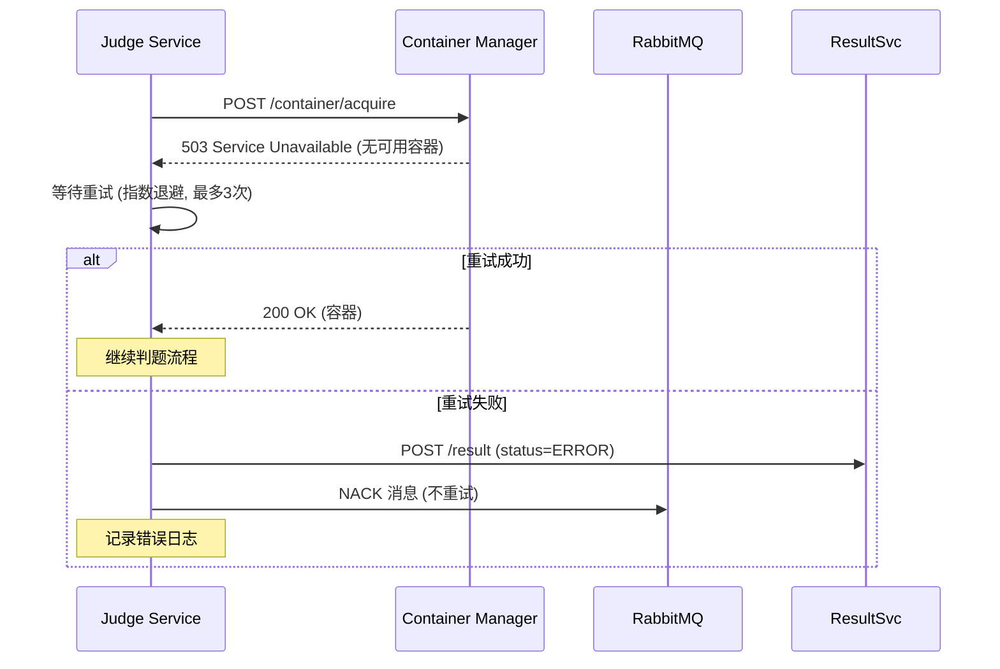

### 5.2 SQL 执行超时

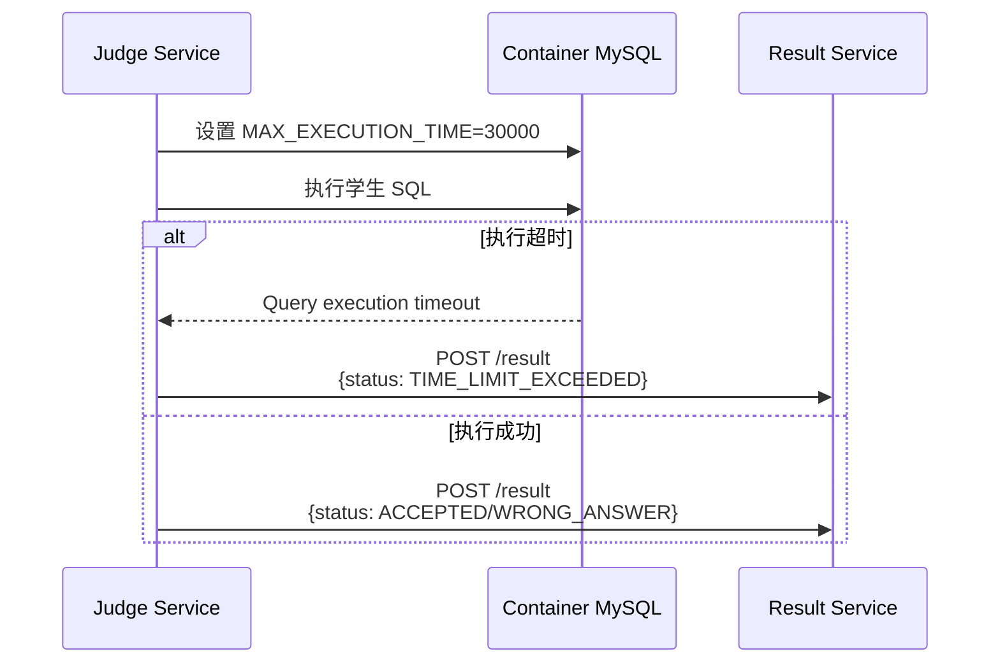

---

## 6. 并发控制

### 6.1 容器池并发

- container-manager 使用连接池管理 Docker API
- 容器获取使用互斥锁防止同一容器被并发分配
- 容器池水位监控，低于阈值时异步启动新容器

### 6.2 判题并发

- judge-service 多个实例消费 RabbitMQ 同一队列
- RabbitMQ 消费者组确保消息负载均衡
- 每个实例维护本地容器缓存减少 container-manager 调用

---

## 7. 监控指标

| 指标 | 说明 | 采集点 |
|------|------|--------|
| container_pool_size | 当前池中容器数 | container-manager |
| container_available | 可用容器数 | container-manager |
| container_acquire_time | 容器获取耗时 | container-manager |
| judge_queue_size | 判题队列长度 | judge-service |
| judge_execution_time | 判题执行耗时 | judge-service |
| judge_success_rate | 判题成功率 | judge-service |
| submission_count | 提交总数 | submission-service |
